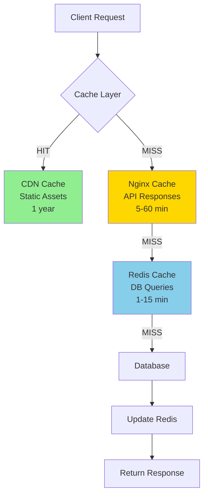
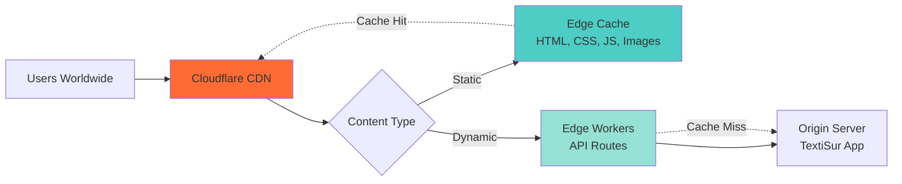
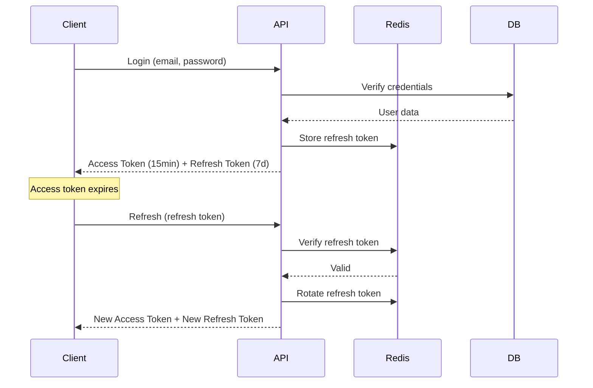
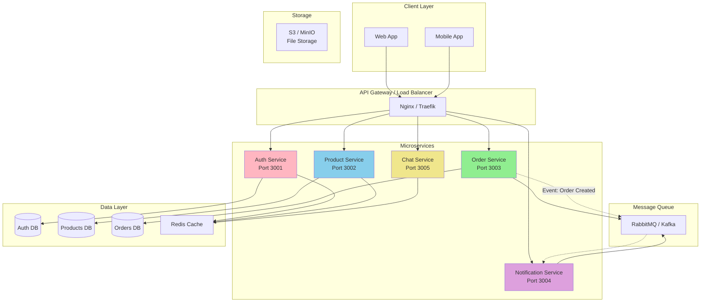
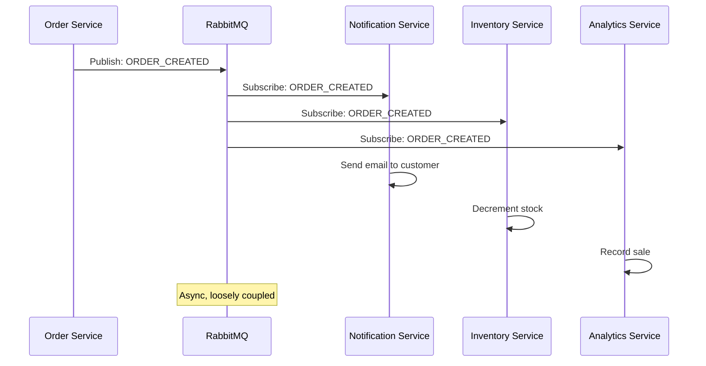

# 🏢 TextiSur - Enterprise Production Audit 2025

**Document Version:** 1.0  
**Audit Date:** December 2024  
**Target Deployment:** Q1 2025  
**Classification:** Internal - Engineering Team

---

## Executive Summary

This audit provides enterprise-level recommendations for scaling TextiSur from a production-ready application to a high-performance, globally distributed platform capable of handling 100K+ concurrent users.

**Current State:** ✅ Production-ready with Docker, PM2, CI/CD, security basics  
**Target State:** 🎯 Enterprise-grade with microservices, global CDN, observability, 99.99% uptime

**Key Metrics to Achieve:**
- Response Time: <100ms (p95)
- Uptime: 99.99% (4 min/month downtime)
- Concurrent Users: 100,000+
- Database Queries: <10ms (p95)
- API Throughput: 10,000 req/s

---

## 📊 Table of Contents

1. [Performance Optimization](#1-performance-optimization)
2. [Security Hardening](#2-security-hardening)
3. [Scalable Architecture](#3-scalable-architecture)
4. [Observability Stack](#4-observability-stack)
5. [Advanced Testing](#5-advanced-testing)
6. [Modern Deployment](#6-modern-deployment)
7. [Migration Roadmap](#7-migration-roadmap)

---

## 1. Performance Optimization

### 1.1 Next.js Rendering Strategy

#### Current State Analysis
```typescript
// Current: Mix of SSR, CSR, ISR
app/
├── page.tsx          // SSR (can be optimized)
├── products/page.tsx // SSR (should be ISR)
├── stores/page.tsx   // Dynamic (SSR)
└── dashboard/        // CSR (correct)
```

#### Optimization Matrix

| Route | Current | Recommended | Reason | Cache TTL |
|-------|---------|-------------|--------|-----------|
| `/` | SSR | ISR | Rarely changes | 1 hour |
| `/products` | SSR | ISR + Streaming | Product catalog stable | 5 min |
| `/products/[id]` | SSR | ISR | Product details stable | 10 min |
| `/stores` | Dynamic | ISR + Suspense | Store list semi-static | 15 min |
| `/stores/nearby` | Dynamic | CSR | Requires user location | N/A |
| `/messages` | CSR | CSR + RSC | Real-time data | N/A |
| `/dashboard` | CSR | CSR + Server Actions | Private data | N/A |
| `/api/*` | SSR | Edge Functions | Low latency | Varies |

#### Implementation: ISR for Product Pages

```typescript
// app/products/[id]/page.tsx
export const revalidate = 600; // 10 minutes

export async function generateStaticParams() {
  const products = await getPopularProducts(100);
  return products.map((p) => ({ id: p.id.toString() }));
}

async function ProductPage({ params }: { params: { id: string } }) {
  const product = await getProduct(params.id);
  
  return (
    <Suspense fallback={<ProductSkeleton />}>
      <ProductDetail product={product} />
    </Suspense>
  );
}
```

#### Server Actions for Mutations

```typescript
// app/actions/cart.ts
'use server'

import { revalidatePath } from 'next/cache';

export async function addToCartAction(productId: number, quantity: number) {
  const session = await getSession();
  if (!session) throw new Error('Unauthorized');
  
  await addToCart(session.userId, productId, quantity);
  revalidatePath('/cart');
  
  return { success: true };
}
```

### 1.2 Advanced Caching Strategy



#### Redis Caching Implementation

```typescript
// lib/cache.ts
import Redis from 'ioredis';

const redis = new Redis(process.env.REDIS_URL!);

export async function getCached<T>(
  key: string,
  fetcher: () => Promise<T>,
  ttl: number = 300
): Promise<T> {
  // Try cache first
  const cached = await redis.get(key);
  if (cached) return JSON.parse(cached);
  
  // Fetch fresh data
  const data = await fetcher();
  
  // Store in cache
  await redis.setex(key, ttl, JSON.stringify(data));
  
  return data;
}

// Usage in API route
export async function GET(req: Request) {
  const products = await getCached(
    'products:all',
    () => Product.findAll(),
    300 // 5 minutes
  );
  
  return Response.json(products);
}
```

### 1.3 CDN Integration Strategy



#### Cloudflare Configuration

```javascript
// pages/_middleware.ts (Cloudflare Edge)
export async function middleware(request) {
  const cache = caches.default;
  const cacheKey = new Request(request.url, request);
  
  // Try cache
  let response = await cache.match(cacheKey);
  
  if (!response) {
    response = await fetch(request);
    
    // Cache static assets
    if (request.url.includes('/static/') || request.url.includes('/_next/')) {
      const headers = new Headers(response.headers);
      headers.set('Cache-Control', 'public, max-age=31536000, immutable');
      response = new Response(response.body, { ...response, headers });
      await cache.put(cacheKey, response.clone());
    }
  }
  
  return response;
}
```

### 1.4 HTTP/2 & Compression Optimization

#### Nginx Configuration Update

```nginx
# nginx.conf additions

# Enable HTTP/2
listen 443 ssl http2;

# Keep-alive optimization
keepalive_timeout 65;
keepalive_requests 1000;

# Enable Brotli (requires nginx-module-brotli)
brotli on;
brotli_comp_level 6;
brotli_types
    text/plain
    text/css
    application/json
    application/javascript
    text/xml
    application/xml
    image/svg+xml;

# Gzip fallback
gzip on;
gzip_vary on;
gzip_comp_level 6;
gzip_min_length 1000;

# HTTP/2 Server Push
http2_push_preload on;

# Connection pooling to backend
upstream backend {
    server app:3000;
    keepalive 32;
}
```

### 1.5 Database Query Optimization

#### Add Database Indexes

```sql
-- Critical indexes for performance
CREATE INDEX idx_products_status ON products(status);
CREATE INDEX idx_products_category ON products(category);
CREATE INDEX idx_products_storeid_status ON products(storeId, status);
CREATE INDEX idx_orders_userid_status ON orders(userId, status);
CREATE INDEX idx_messages_conversation ON messages(conversationId, createdAt DESC);
CREATE INDEX idx_conversations_buyer ON conversations(buyerId);
CREATE INDEX idx_conversations_store ON conversations(storeId);

-- Full-text search index
ALTER TABLE products ADD FULLTEXT INDEX idx_products_search (name, description);
```

#### Query Optimization

```typescript
// Before: N+1 query problem
const products = await Product.findAll();
for (const product of products) {
  product.store = await Store.findByPk(product.storeId); // N queries!
}

// After: Eager loading
const products = await Product.findAll({
  include: [{
    model: Store,
    as: 'store',
    attributes: ['id', 'name', 'slug']
  }],
  limit: 20,
  offset: page * 20
});
```

### 1.6 Image Optimization Strategy

```typescript
// next.config.js
module.exports = {
  images: {
    formats: ['image/avif', 'image/webp'],
    deviceSizes: [640, 750, 828, 1080, 1200, 1920],
    imageSizes: [16, 32, 48, 64, 96, 128, 256, 384],
    domains: ['picsum.photos', 'your-cdn.com'],
    minimumCacheTTL: 31536000, // 1 year
    
    // Use Cloudflare Image Resizing
    loader: 'custom',
    loaderFile: './lib/cloudflare-loader.js',
  },
};

// lib/cloudflare-loader.js
export default function cloudflareLoader({ src, width, quality }) {
  const params = [`width=${width}`, `quality=${quality || 75}`, 'format=auto'];
  return `https://your-domain.com/cdn-cgi/image/${params.join(',')}/${src}`;
}
```

---

## 2. Security Hardening

### 2.1 JWT Refresh Token Strategy



#### Implementation

```typescript
// lib/auth.ts
import { sign, verify } from 'jsonwebtoken';
import { randomBytes } from 'crypto';

interface TokenPair {
  accessToken: string;
  refreshToken: string;
}

export async function generateTokenPair(userId: number): Promise<TokenPair> {
  // Short-lived access token
  const accessToken = sign(
    { userId, type: 'access' },
    process.env.JWT_SECRET!,
    { expiresIn: '15m' }
  );
  
  // Long-lived refresh token
  const refreshToken = randomBytes(32).toString('hex');
  const refreshTokenHash = await bcrypt.hash(refreshToken, 10);
  
  // Store refresh token in Redis with 7-day expiry
  await redis.setex(
    `refresh:${userId}:${refreshToken}`,
    7 * 24 * 60 * 60,
    refreshTokenHash
  );
  
  return { accessToken, refreshToken };
}

export async function refreshAccessToken(refreshToken: string): Promise<string | null> {
  // Verify refresh token exists in Redis
  const keys = await redis.keys(`refresh:*:${refreshToken}`);
  if (keys.length === 0) return null;
  
  const userId = keys[0].split(':')[1];
  const storedHash = await redis.get(keys[0]);
  
  // Verify token hasn't been tampered
  const valid = await bcrypt.compare(refreshToken, storedHash!);
  if (!valid) return null;
  
  // Delete old refresh token (rotation)
  await redis.del(keys[0]);
  
  // Generate new token pair
  const { accessToken, refreshToken: newRefreshToken } = await generateTokenPair(Number(userId));
  
  return accessToken;
}
```

### 2.2 Advanced Security Headers

```typescript
// middleware.ts
import { NextResponse } from 'next/server';
import type { NextRequest } from 'next/server';

export function middleware(request: NextRequest) {
  const response = NextResponse.next();
  
  // Strict CSP with nonces
  const nonce = Buffer.from(crypto.randomUUID()).toString('base64');
  const csp = `
    default-src 'self';
    script-src 'self' 'nonce-${nonce}' 'strict-dynamic' https://js.stripe.com;
    style-src 'self' 'nonce-${nonce}' 'unsafe-inline';
    img-src 'self' data: https: blob:;
    font-src 'self' data:;
    connect-src 'self' https://api.stripe.com wss://ws.your-domain.com;
    frame-src https://js.stripe.com https://hooks.stripe.com;
    base-uri 'self';
    form-action 'self';
    frame-ancestors 'none';
  `.replace(/\s{2,}/g, ' ').trim();
  
  response.headers.set('Content-Security-Policy', csp);
  response.headers.set('X-Content-Type-Options', 'nosniff');
  response.headers.set('X-Frame-Options', 'DENY');
  response.headers.set('X-XSS-Protection', '1; mode=block');
  response.headers.set('Referrer-Policy', 'strict-origin-when-cross-origin');
  
  // Cross-Origin Policies
  response.headers.set('Cross-Origin-Opener-Policy', 'same-origin');
  response.headers.set('Cross-Origin-Resource-Policy', 'same-origin');
  response.headers.set('Cross-Origin-Embedder-Policy', 'require-corp');
  
  // Permissions Policy
  response.headers.set('Permissions-Policy', 
    'camera=(), microphone=(), geolocation=(self), payment=(self)'
  );
  
  // HSTS
  response.headers.set('Strict-Transport-Security', 
    'max-age=31536000; includeSubDomains; preload'
  );
  
  // Store nonce for CSP
  response.headers.set('X-Nonce', nonce);
  
  return response;
}
```

### 2.3 Environment-Specific CORS

```typescript
// lib/cors.ts
const CORS_ORIGINS = {
  development: ['http://localhost:3000', 'http://localhost:9003'],
  staging: ['https://staging.textisur.com'],
  production: ['https://textisur.com', 'https://www.textisur.com'],
};

export function getCorsOrigins(): string[] {
  const env = process.env.NODE_ENV as keyof typeof CORS_ORIGINS;
  return CORS_ORIGINS[env] || CORS_ORIGINS.production;
}

// middleware.ts
export function corsMiddleware(request: Request): Response | null {
  const origin = request.headers.get('origin');
  const allowedOrigins = getCorsOrigins();
  
  if (origin && !allowedOrigins.includes(origin)) {
    return new Response('CORS not allowed', { status: 403 });
  }
  
  return null;
}
```

### 2.4 Input Sanitization

```typescript
// lib/sanitize.ts
import DOMPurify from 'isomorphic-dompurify';
import { z } from 'zod';

// Server-side validation schemas
export const ProductSchema = z.object({
  name: z.string().min(3).max(150).trim(),
  description: z.string().max(5000).trim(),
  price: z.number().positive().max(1000000),
  category: z.string().max(100).trim(),
  stock: z.number().int().nonnegative(),
});

export const MessageSchema = z.object({
  conversationId: z.number().int().positive(),
  content: z.string().min(1).max(5000).trim(),
  type: z.enum(['text', 'image', 'file']),
});

// Sanitize HTML content
export function sanitizeHtml(dirty: string): string {
  return DOMPurify.sanitize(dirty, {
    ALLOWED_TAGS: ['b', 'i', 'em', 'strong', 'a', 'p', 'br'],
    ALLOWED_ATTR: ['href'],
  });
}

// Usage in API route
export async function POST(req: Request) {
  const body = await req.json();
  
  // Validate and sanitize
  const validated = MessageSchema.parse(body);
  validated.content = sanitizeHtml(validated.content);
  
  // Process...
}
```

### 2.5 Secrets Management

```typescript
// lib/secrets.ts
import { SecretsManagerClient, GetSecretValueCommand } from '@aws-sdk/client-secrets-manager';

const client = new SecretsManagerClient({ region: 'us-east-1' });

export async function getSecret(secretName: string): Promise<string> {
  try {
    const response = await client.send(
      new GetSecretValueCommand({ SecretId: secretName })
    );
    return response.SecretString!;
  } catch (error) {
    console.error(`Failed to retrieve secret: ${secretName}`, error);
    throw error;
  }
}

// Usage in production
const stripeKey = await getSecret('prod/textisur/stripe-secret-key');
```

---

## 3. Scalable Architecture

### 3.1 Microservices Blueprint 2025



### 3.2 Service Decomposition Strategy

| Service | Responsibility | Database | Port | Tech Stack |
|---------|----------------|----------|------|------------|
| **Auth Service** | User auth, JWT, sessions | PostgreSQL | 3001 | Node.js, Redis |
| **Product Service** | Catalog, search, inventory | MySQL | 3002 | Node.js, Elasticsearch |
| **Order Service** | Orders, payments, fulfillment | PostgreSQL | 3003 | Node.js, Stripe |
| **Notification Service** | Email, SMS, push notifications | MongoDB | 3004 | Node.js, Bull Queue |
| **Chat Service** | Real-time messaging | MongoDB | 3005 | Node.js, Socket.io |
| **Analytics Service** | Metrics, reporting, dashboards | ClickHouse | 3006 | Python, Pandas |
| **Search Service** | Full-text search, filters | Elasticsearch | 3007 | Elasticsearch |

### 3.3 Event-Driven Architecture



#### RabbitMQ Integration

```typescript
// lib/message-queue.ts
import amqp from 'amqplib';

class MessageQueue {
  private connection: amqp.Connection | null = null;
  private channel: amqp.Channel | null = null;
  
  async connect() {
    this.connection = await amqp.connect(process.env.RABBITMQ_URL!);
    this.channel = await this.connection.createChannel();
  }
  
  async publish(exchange: string, routingKey: string, message: any) {
    if (!this.channel) await this.connect();
    
    await this.channel!.assertExchange(exchange, 'topic', { durable: true });
    this.channel!.publish(
      exchange,
      routingKey,
      Buffer.from(JSON.stringify(message)),
      { persistent: true }
    );
  }
  
  async subscribe(exchange: string, routingKey: string, handler: (msg: any) => Promise<void>) {
    if (!this.channel) await this.connect();
    
    await this.channel!.assertExchange(exchange, 'topic', { durable: true });
    const q = await this.channel!.assertQueue('', { exclusive: true });
    
    await this.channel!.bindQueue(q.queue, exchange, routingKey);
    
    this.channel!.consume(q.queue, async (msg) => {
      if (msg) {
        const content = JSON.parse(msg.content.toString());
        await handler(content);
        this.channel!.ack(msg);
      }
    });
  }
}

export const mq = new MessageQueue();

// Usage in Order Service
await mq.publish('orders', 'order.created', {
  orderId: 123,
  userId: 456,
  total: 50.00,
  timestamp: new Date().toISOString(),
});
```

### 3.4 Redis Integration Strategy

```typescript
// lib/redis-client.ts
import Redis from 'ioredis';
import { Cluster } from 'ioredis';

// Standalone Redis
export const redis = new Redis({
  host: process.env.REDIS_HOST,
  port: Number(process.env.REDIS_PORT),
  password: process.env.REDIS_PASSWORD,
  db: 0,
  retryStrategy: (times) => Math.min(times * 50, 2000),
});

// Redis Cluster (production)
export const redisCluster = new Cluster([
  { host: 'redis-1', port: 7000 },
  { host: 'redis-2', port: 7001 },
  { host: 'redis-3', port: 7002 },
]);

// Cache layer
export class CacheService {
  async get<T>(key: string): Promise<T | null> {
    const data = await redis.get(key);
    return data ? JSON.parse(data) : null;
  }
  
  async set(key: string, value: any, ttl: number = 300): Promise<void> {
    await redis.setex(key, ttl, JSON.stringify(value));
  }
  
  async invalidate(pattern: string): Promise<void> {
    const keys = await redis.keys(pattern);
    if (keys.length > 0) {
      await redis.del(...keys);
    }
  }
}

// Session store
export class SessionStore {
  async create(userId: number, data: any): Promise<string> {
    const sessionId = crypto.randomUUID();
    await redis.setex(`session:${sessionId}`, 86400, JSON.stringify({ userId, ...data }));
    return sessionId;
  }
  
  async get(sessionId: string): Promise<any | null> {
    const data = await redis.get(`session:${sessionId}`);
    return data ? JSON.parse(data) : null;
  }
  
  async destroy(sessionId: string): Promise<void> {
    await redis.del(`session:${sessionId}`);
  }
}
```

---

*This document continues with sections 4-7. Due to length, I'll create it as a file.*
