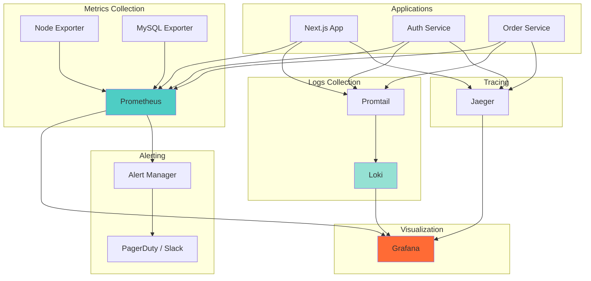
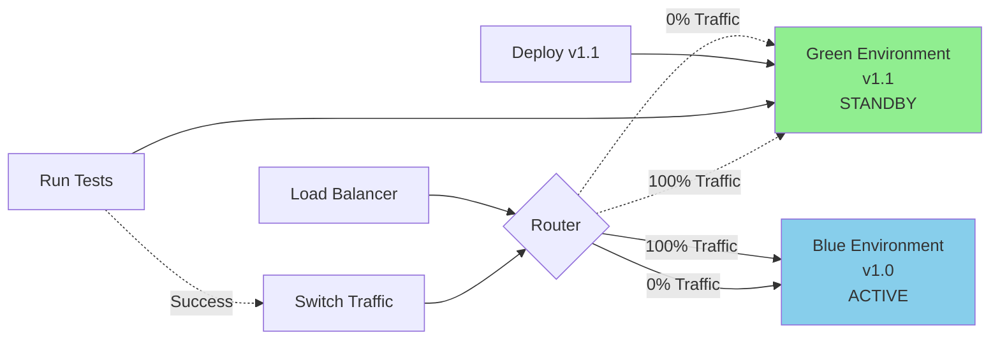
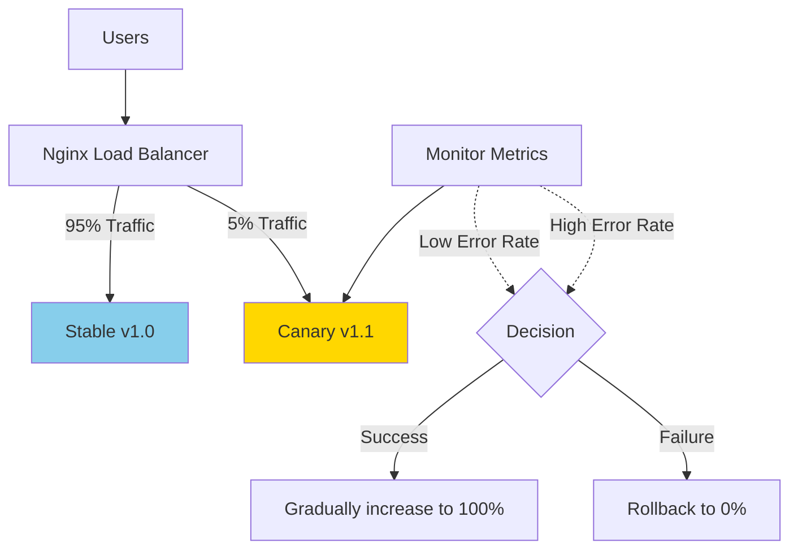
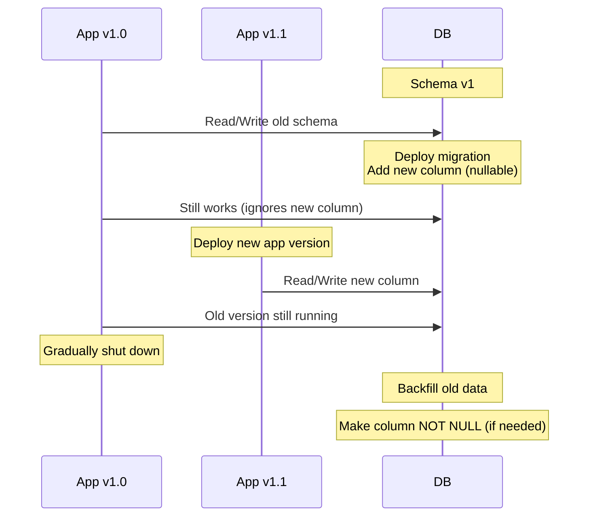

# 🏢 TextiSur - Enterprise Production Audit 2025 (Part 2)

*Continuation from Part 1*

---

## 4. Observability Stack

### 4.1 Prometheus + Grafana + Loki Architecture



### 4.2 Prometheus Configuration

```yaml
# prometheus.yml
global:
  scrape_interval: 15s
  evaluation_interval: 15s

# Alerting
alerting:
  alertmanagers:
    - static_configs:
        - targets: ['alertmanager:9093']

# Load rules
rule_files:
  - '/etc/prometheus/alerts/*.yml'

# Scrape configs
scrape_configs:
  - job_name: 'textisur-app'
    static_configs:
      - targets: ['app:3000']
    metrics_path: '/api/metrics'
    
  - job_name: 'node-exporter'
    static_configs:
      - targets: ['nodeexporter:9100']
      
  - job_name: 'mysql'
    static_configs:
      - targets: ['mysql-exporter:9104']
      
  - job_name: 'nginx'
    static_configs:
      - targets: ['nginx-exporter:9113']
```

### 4.3 Custom Application Metrics

```typescript
// lib/metrics.ts
import client from 'prom-client';

// Register
const register = new client.Registry();

// Default metrics (CPU, memory)
client.collectDefaultMetrics({ register });

// Custom metrics
export const httpRequestDuration = new client.Histogram({
  name: 'http_request_duration_seconds',
  help: 'Duration of HTTP requests in seconds',
  labelNames: ['method', 'route', 'status_code'],
  buckets: [0.1, 0.5, 1, 2, 5],
  registers: [register],
});

export const activeUsers = new client.Gauge({
  name: 'active_users_total',
  help: 'Number of currently active users',
  registers: [register],
});

export const orderTotal = new client.Counter({
  name: 'orders_total',
  help: 'Total number of orders',
  labelNames: ['status'],
  registers: [register],
});

export const checkoutDuration = new client.Histogram({
  name: 'checkout_duration_seconds',
  help: 'Time to complete checkout',
  buckets: [1, 3, 5, 10, 30, 60],
  registers: [register],
});

// Middleware to track request duration
export function metricsMiddleware(req: Request, res: Response, next: Function) {
  const start = Date.now();
  
  res.on('finish', () => {
    const duration = (Date.now() - start) / 1000;
    httpRequestDuration
      .labels(req.method, req.route?.path || req.path, res.statusCode.toString())
      .observe(duration);
  });
  
  next();
}

// Metrics endpoint
export async function GET() {
  const metrics = await register.metrics();
  return new Response(metrics, {
    headers: { 'Content-Type': register.contentType },
  });
}
```

### 4.4 Alert Rules

```yaml
# alerts/textisur.yml
groups:
  - name: textisur_alerts
    interval: 30s
    rules:
      # High error rate
      - alert: HighErrorRate
        expr: rate(http_requests_total{status_code=~"5.."}[5m]) > 0.05
        for: 5m
        labels:
          severity: critical
        annotations:
          summary: "High error rate detected"
          description: "Error rate is {{ $value | humanizePercentage }}"
      
      # Slow response time
      - alert: SlowResponseTime
        expr: histogram_quantile(0.95, rate(http_request_duration_seconds_bucket[5m])) > 1
        for: 10m
        labels:
          severity: warning
        annotations:
          summary: "Slow API response time"
          description: "95th percentile is {{ $value }}s"
      
      # Database connection pool exhausted
      - alert: DatabasePoolExhausted
        expr: mysql_global_status_threads_connected / mysql_global_variables_max_connections > 0.8
        for: 5m
        labels:
          severity: warning
        annotations:
          summary: "Database connection pool nearly exhausted"
      
      # High memory usage
      - alert: HighMemoryUsage
        expr: (node_memory_MemTotal_bytes - node_memory_MemAvailable_bytes) / node_memory_MemTotal_bytes > 0.9
        for: 5m
        labels:
          severity: critical
        annotations:
          summary: "High memory usage detected"
      
      # Service down
      - alert: ServiceDown
        expr: up == 0
        for: 2m
        labels:
          severity: critical
        annotations:
          summary: "Service {{ $labels.job }} is down"
```

### 4.5 Grafana Dashboards

```json
{
  "dashboard": {
    "title": "TextiSur - Application Overview",
    "panels": [
      {
        "title": "Request Rate",
        "targets": [
          {
            "expr": "rate(http_requests_total[5m])"
          }
        ]
      },
      {
        "title": "Error Rate",
        "targets": [
          {
            "expr": "rate(http_requests_total{status_code=~\"5..\"}[5m])"
          }
        ]
      },
      {
        "title": "Response Time (p95)",
        "targets": [
          {
            "expr": "histogram_quantile(0.95, rate(http_request_duration_seconds_bucket[5m]))"
          }
        ]
      },
      {
        "title": "Active Users",
        "targets": [
          {
            "expr": "active_users_total"
          }
        ]
      }
    ]
  }
}
```

### 4.6 Distributed Tracing with Jaeger

```typescript
// lib/tracing.ts
import { NodeTracerProvider } from '@opentelemetry/sdk-trace-node';
import { registerInstrumentations } from '@opentelemetry/instrumentation';
import { HttpInstrumentation } from '@opentelemetry/instrumentation-http';
import { ExpressInstrumentation } from '@opentelemetry/instrumentation-express';
import { JaegerExporter } from '@opentelemetry/exporter-jaeger';
import { Resource } from '@opentelemetry/resources';
import { SemanticResourceAttributes } from '@opentelemetry/semantic-conventions';

export function initTracing() {
  const provider = new NodeTracerProvider({
    resource: new Resource({
      [SemanticResourceAttributes.SERVICE_NAME]: 'textisur-app',
    }),
  });
  
  const exporter = new JaegerExporter({
    endpoint: process.env.JAEGER_ENDPOINT || 'http://localhost:14268/api/traces',
  });
  
  provider.addSpanProcessor(new BatchSpanProcessor(exporter));
  provider.register();
  
  registerInstrumentations({
    instrumentations: [
      new HttpInstrumentation(),
      new ExpressInstrumentation(),
    ],
  });
}
```

### 4.7 Critical KPIs to Monitor

| Metric | Target | Alert Threshold | Business Impact |
|--------|--------|-----------------|-----------------|
| **Availability** | 99.99% | <99.95% | Revenue loss, reputation |
| **Response Time (p95)** | <100ms | >500ms | User frustration, cart abandonment |
| **Error Rate** | <0.1% | >1% | Failed transactions, support tickets |
| **Database Query Time** | <10ms | >50ms | Slow page loads |
| **Checkout Success Rate** | >98% | <95% | Lost sales |
| **WebSocket Connection Success** | >99% | <98% | Broken messaging |
| **Push Notification Delivery** | >95% | <90% | Missed communications |
| **CDN Hit Rate** | >90% | <80% | High origin load |

---

## 5. Advanced Testing

### 5.1 E2E Tests with Stripe

```typescript
// tests/e2e/checkout.spec.ts
import { test, expect } from '@playwright/test';

test.describe('Checkout Flow', () => {
  test('Complete purchase with Stripe', async ({ page }) => {
    // Login
    await page.goto('/login');
    await page.fill('[name="email"]', 'test@example.com');
    await page.fill('[name="password"]', 'TestPassword123!');
    await page.click('button[type="submit"]');
    
    // Add product to cart
    await page.goto('/products/1');
    await page.click('text=Agregar al Carrito');
    
    // Go to checkout
    await page.goto('/cart');
    await page.click('text=Proceder al Pago');
    
    // Wait for Stripe redirect
    await page.waitForURL(/checkout\.stripe\.com/);
    
    // Fill Stripe form (test mode)
    await page.fill('[name="cardNumber"]', '4242424242424242');
    await page.fill('[name="cardExpiry"]', '12/34');
    await page.fill('[name="cardCvc"]', '123');
    await page.fill('[name="billingName"]', 'Test User');
    
    // Submit payment
    await page.click('button[type="submit"]');
    
    // Verify redirect to success page
    await page.waitForURL('/orders/success');
    await expect(page.locator('text=Pedido Confirmado')).toBeVisible();
    
    // Verify order in database
    const orderId = await page.locator('[data-order-id]').getAttribute('data-order-id');
    const order = await db.orders.findByPk(orderId);
    expect(order.status).toBe('enviado');
  });
});
```

### 5.2 Load Testing with k6

```javascript
// tests/load/checkout-load.js
import http from 'k6/http';
import { check, sleep } from 'k6';
import { Rate } from 'k6/metrics';

const errorRate = new Rate('errors');

export const options = {
  stages: [
    { duration: '2m', target: 100 }, // Ramp up to 100 users
    { duration: '5m', target: 100 }, // Stay at 100 users
    { duration: '2m', target: 500 }, // Ramp up to 500 users
    { duration: '5m', target: 500 }, // Stay at 500 users
    { duration: '2m', target: 1000 }, // Spike to 1000 users
    { duration: '3m', target: 1000 }, // Stay at peak
    { duration: '2m', target: 0 }, // Ramp down
  ],
  thresholds: {
    http_req_duration: ['p(95)<500'], // 95% of requests under 500ms
    http_req_failed: ['rate<0.01'], // Error rate under 1%
    errors: ['rate<0.1'],
  },
};

export default function() {
  // Login
  const loginRes = http.post('https://textisur.com/api/auth/login', JSON.stringify({
    email: `user${__VU}@test.com`,
    password: 'TestPassword123!',
  }), {
    headers: { 'Content-Type': 'application/json' },
  });
  
  check(loginRes, {
    'login status 200': (r) => r.status === 200,
  }) || errorRate.add(1);
  
  const token = loginRes.json('token');
  
  // Get products
  const productsRes = http.get('https://textisur.com/api/products', {
    headers: { 'Authorization': `Bearer ${token}` },
  });
  
  check(productsRes, {
    'products loaded': (r) => r.status === 200 && r.json('products').length > 0,
  }) || errorRate.add(1);
  
  // Create checkout session
  const checkoutRes = http.post('https://textisur.com/api/checkout', JSON.stringify({
    items: [{ productId: 1, quantity: 1 }],
  }), {
    headers: {
      'Authorization': `Bearer ${token}`,
      'Content-Type': 'application/json',
    },
  });
  
  check(checkoutRes, {
    'checkout created': (r) => r.status === 200 && r.json('sessionId'),
  }) || errorRate.add(1);
  
  sleep(1);
}
```

### 5.3 WebSocket Stress Test

```javascript
// tests/load/websocket-stress.js
import ws from 'k6/ws';
import { check } from 'k6';

export const options = {
  stages: [
    { duration: '1m', target: 500 },
    { duration: '3m', target: 500 },
    { duration: '1m', target: 0 },
  ],
};

export default function() {
  const url = 'wss://textisur.com/socket.io/?EIO=4&transport=websocket';
  
  const res = ws.connect(url, {}, function(socket) {
    socket.on('open', () => {
      console.log('WebSocket connected');
      
      // Join conversation
      socket.send(JSON.stringify({
        type: 'join',
        conversationId: 1,
      }));
    });
    
    socket.on('message', (data) => {
      check(data, {
        'message received': (d) => d !== null,
      });
    });
    
    socket.on('close', () => {
      console.log('WebSocket closed');
    });
    
    // Send message every 5 seconds
    socket.setInterval(() => {
      socket.send(JSON.stringify({
        type: 'message',
        content: 'Test message',
        conversationId: 1,
      }));
    }, 5000);
    
    socket.setTimeout(() => {
      socket.close();
    }, 30000); // Close after 30 seconds
  });
  
  check(res, {
    'WebSocket connection successful': (r) => r && r.status === 101,
  });
}
```

### 5.4 Chaos Engineering Tests

```bash
#!/bin/bash
# tests/chaos/kill-random-service.sh

echo "🔥 Starting chaos engineering test..."

# Kill random PM2 process
PROCESSES=(textisur-auth textisur-products textisur-orders)
RANDOM_PROCESS=${PROCESSES[$RANDOM % ${#PROCESSES[@]}]}

echo "Killing process: $RANDOM_PROCESS"
pm2 stop $RANDOM_PROCESS

# Wait 30 seconds
echo "Waiting 30 seconds..."
sleep 30

# Check if service recovered
if pm2 list | grep -q "$RANDOM_PROCESS.*online"; then
  echo "✅ Service auto-recovered"
  exit 0
else
  echo "❌ Service did not recover"
  pm2 restart $RANDOM_PROCESS
  exit 1
fi
```

---

## 6. Modern Deployment Strategies

### 6.1 Blue-Green Deployment



#### Implementation

```yaml
# docker-compose-blue.yml
version: '3.8'
services:
  app-blue:
    image: textisur:v1.0
    container_name: textisur-blue
    ports:
      - "3000:3000"
    environment:
      - NODE_ENV=production
      - VERSION=blue

# docker-compose-green.yml
version: '3.8'
services:
  app-green:
    image: textisur:v1.1
    container_name: textisur-green
    ports:
      - "3001:3000"
    environment:
      - NODE_ENV=production
      - VERSION=green
```

```bash
#!/bin/bash
# scripts/blue-green-deploy.sh

CURRENT_ENV="blue"
NEW_ENV="green"
NEW_VERSION="v1.1"

echo "🚀 Starting blue-green deployment..."

# 1. Deploy to green environment
echo "Deploying $NEW_VERSION to $NEW_ENV..."
docker-compose -f docker-compose-green.yml up -d
sleep 10

# 2. Run health checks
echo "Running health checks..."
for i in {1..30}; do
  if curl -f http://localhost:3001/api/health; then
    echo "✅ Health check passed"
    break
  fi
  sleep 2
done

# 3. Run smoke tests
echo "Running smoke tests..."
newman run tests/api-tests.postman_collection.json --env-var "baseUrl=http://localhost:3001"

if [ $? -eq 0 ]; then
  echo "✅ Smoke tests passed"
else
  echo "❌ Smoke tests failed, rolling back..."
  docker-compose -f docker-compose-green.yml down
  exit 1
fi

# 4. Switch traffic (update Nginx)
echo "Switching traffic to $NEW_ENV..."
sed -i 's/server app-blue:3000;/server app-green:3000;/g' nginx/nginx.conf
nginx -s reload

# 5. Monitor for 5 minutes
echo "Monitoring new environment..."
sleep 300

# 6. Check error rate
ERROR_RATE=$(curl -s http://localhost:9090/api/v1/query?query=rate\(http_requests_total{status_code=~\"5..\"}[5m]\) | jq '.data.result[0].value[1] | tonumber')

if (( $(echo "$ERROR_RATE < 0.01" | bc -l) )); then
  echo "✅ Deployment successful, stopping old environment"
  docker-compose -f docker-compose-blue.yml down
else
  echo "❌ High error rate detected, rolling back..."
  sed -i 's/server app-green:3000;/server app-blue:3000;/g' nginx/nginx.conf
  nginx -s reload
  docker-compose -f docker-compose-green.yml down
  exit 1
fi

echo "🎉 Blue-green deployment complete!"
```

### 6.2 Canary Releases



#### Nginx Configuration

```nginx
# Weighted load balancing for canary
upstream backend {
    server app-stable:3000 weight=95;
    server app-canary:3000 weight=5;
}

# Or header-based canary
upstream backend {
    server app-stable:3000;
    server app-canary:3000;
}

server {
    location / {
        set $backend backend;
        
        # Route beta users to canary
        if ($http_x_beta_user = "true") {
            set $backend app-canary:3000;
        }
        
        proxy_pass http://$backend;
    }
}
```

### 6.3 Zero-Downtime Database Migrations



#### Migration Strategy

```javascript
// migrations/20250101-add-user-preferences.js
module.exports = {
  async up(queryInterface, Sequelize) {
    // Step 1: Add column as nullable
    await queryInterface.addColumn('users', 'preferences', {
      type: Sequelize.JSON,
      allowNull: true, // Important for zero-downtime
      defaultValue: {},
    });
    
    // Step 2: Backfill existing data (run async)
    // This is done in a separate script to avoid blocking
  },
  
  async down(queryInterface) {
    await queryInterface.removeColumn('users', 'preferences');
  },
};

// migrations/20250102-backfill-user-preferences.js
module.exports = {
  async up(queryInterface) {
    // Run in batches to avoid locking
    await queryInterface.sequelize.query(`
      UPDATE users
      SET preferences = '{}'
      WHERE preferences IS NULL
      LIMIT 1000;
    `);
    // Repeat until all rows updated
  },
};

// migrations/20250103-make-preferences-not-null.js
module.exports = {
  async up(queryInterface, Sequelize) {
    // Only after all instances updated
    await queryInterface.changeColumn('users', 'preferences', {
      type: Sequelize.JSON,
      allowNull: false,
    });
  },
};
```

### 6.4 Circuit Breaker Pattern

```typescript
// lib/circuit-breaker.ts
enum CircuitState {
  CLOSED = 'CLOSED', // Normal operation
  OPEN = 'OPEN', // Failing, reject requests
  HALF_OPEN = 'HALF_OPEN', // Testing recovery
}

class CircuitBreaker {
  private state: CircuitState = CircuitState.CLOSED;
  private failureCount = 0;
  private successCount = 0;
  private nextAttempt = Date.now();
  
  constructor(
    private threshold: number = 5,
    private timeout: number = 60000, // 1 minute
  ) {}
  
  async execute<T>(fn: () => Promise<T>): Promise<T> {
    if (this.state === CircuitState.OPEN) {
      if (Date.now() < this.nextAttempt) {
        throw new Error('Circuit breaker is OPEN');
      }
      this.state = CircuitState.HALF_OPEN;
    }
    
    try {
      const result = await fn();
      this.onSuccess();
      return result;
    } catch (error) {
      this.onFailure();
      throw error;
    }
  }
  
  private onSuccess() {
    this.failureCount = 0;
    
    if (this.state === CircuitState.HALF_OPEN) {
      this.successCount++;
      if (this.successCount >= this.threshold) {
        this.state = CircuitState.CLOSED;
        this.successCount = 0;
      }
    }
  }
  
  private onFailure() {
    this.failureCount++;
    this.successCount = 0;
    
    if (this.failureCount >= this.threshold) {
      this.state = CircuitState.OPEN;
      this.nextAttempt = Date.now() + this.timeout;
    }
  }
}

// Usage
const stripeBreaker = new CircuitBreaker(5, 60000);

export async function createCheckout(data: any) {
  return stripeBreaker.execute(async () => {
    const session = await stripe.checkout.sessions.create(data);
    return session;
  });
}
```

---

*Continues in Part 3...*
