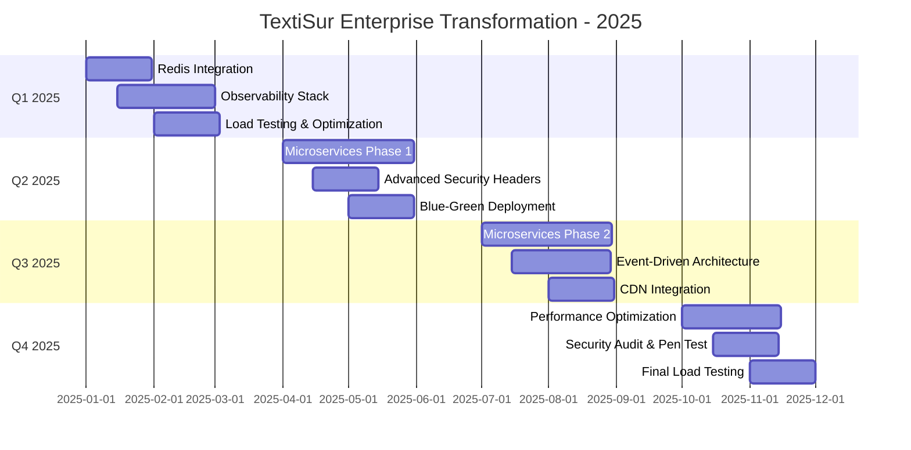

# 🏢 TextiSur - Enterprise Production Audit 2025 (Part 3 - Final)

*Continuation from Parts 1 & 2*

---

## 7. Migration Roadmap to 2025

### 7.1 Quarterly Implementation Plan



### 7.2 Phase-by-Phase Breakdown

#### **Phase 1: Foundation (Q1 2025) - "Observe & Cache"**

**Objectives:**
- Implement comprehensive observability
- Add Redis caching layer
- Establish baseline performance metrics

**Tasks:**
1. Deploy Prometheus + Grafana + Loki stack
2. Instrument all API endpoints with custom metrics
3. Set up alerting rules and PagerDuty integration
4. Deploy Redis cluster (3 nodes)
5. Implement caching layer for:
   - Product listings (5 min TTL)
   - Store information (15 min TTL)
   - User sessions
   - API rate limiting
6. Run load tests to establish baseline
7. Document current performance (p50, p95, p99)

**Success Criteria:**
- ✅ All metrics visible in Grafana
- ✅ Redis hit rate >70%
- ✅ P95 response time <200ms
- ✅ Alert fatigue <5 alerts/day

**Estimated Cost:** $500/month (Redis, monitoring tools)

---

#### **Phase 2: Security & Deployment (Q2 2025) - "Harden & Automate"**

**Objectives:**
- Implement advanced security measures
- Establish blue-green deployment
- Begin service decomposition planning

**Tasks:**
1. Implement JWT refresh tokens with rotation
2. Update security headers (CSP with nonces, COOP, CORP)
3. Conduct external security audit
4. Set up blue-green deployment pipeline
5. Implement canary release process
6. Create microservices architecture blueprint
7. Extract Auth Service as first microservice

**Success Criteria:**
- ✅ Zero-downtime deployments
- ✅ Security audit score >90/100
- ✅ Auth service running independently
- ✅ Rollback time <5 minutes

**Estimated Cost:** $1,500 (security audit) + $300/month (additional infrastructure)

---

#### **Phase 3: Microservices (Q3 2025) - "Decompose & Scale"**

**Objectives:**
- Extract core services
- Implement event-driven architecture
- Deploy to CDN edge locations

**Tasks:**
1. Extract Product Service
2. Extract Order Service
3. Extract Notification Service
4. Deploy RabbitMQ cluster
5. Implement async event handling
6. Integrate Cloudflare CDN
7. Move static assets to edge
8. Implement edge caching for API routes

**Success Criteria:**
- ✅ 4+ microservices operational
- ✅ Event processing <100ms
- ✅ CDN cache hit rate >85%
- ✅ Global TTFB <50ms

**Estimated Cost:** $2,000/month (additional services, CDN, message queue)

---

#### **Phase 4: Optimization (Q4 2025) - "Refine & Prove"**

**Objectives:**
- Optimize all services for peak performance
- Achieve target KPIs
- Prepare for 100K concurrent users

**Tasks:**
1. Database query optimization
2. Implement connection pooling
3. Add database read replicas
4. Optimize Next.js rendering (ISR where possible)
5. Implement HTTP/2 push
6. Run stress tests (10K → 100K users)
7. Conduct final penetration testing
8. Create disaster recovery plan

**Success Criteria:**
- ✅ Sustain 100,000 concurrent users
- ✅ P95 response time <100ms
- ✅ 99.99% uptime
- ✅ Error rate <0.01%

**Estimated Cost:** $3,500/month (database replicas, increased capacity)

---

### 7.3 Technology Migration Matrix

| Component | Current | Q1 2025 | Q2 2025 | Q3 2025 | Q4 2025 |
|-----------|---------|---------|---------|---------|---------|
| **Architecture** | Monolith | Monolith + Redis | Monolith + Auth μs | 4 Microservices | 6 Microservices |
| **Database** | MySQL Single | MySQL + Redis | MySQL + Redis | MySQL + Replicas | MySQL Cluster |
| **CDN** | None | None | Cloudflare (Assets) | Cloudflare (Full) | Edge Workers |
| **Caching** | None | Redis (Sessions) | Redis (Full) | Redis Cluster | Redis + CDN |
| **Monitoring** | PM2 Logs | Prometheus + Grafana | + Loki + Alerts | + Jaeger Tracing | Full Observability |
| **Deployment** | PM2 | PM2 | Blue-Green | Canary + BG | Automated Canary |
| **Queue** | None | None | None | RabbitMQ | Kafka |
| **Testing** | Manual | Load Tests | E2E + Load | Chaos + Load | Full Test Suite |

---

### 7.4 Budget & Resource Planning

#### Infrastructure Costs

| Service | Current | Q1 | Q2 | Q3 | Q4 |
|---------|---------|----|----|----|----|
| **VPS (App)** | $50 | $50 | $100 | $200 | $300 |
| **Database** | $30 | $30 | $50 | $100 | $150 |
| **Redis** | $0 | $100 | $150 | $200 | $250 |
| **CDN** | $0 | $0 | $50 | $150 | $200 |
| **Monitoring** | $0 | $50 | $50 | $100 | $100 |
| **Message Queue** | $0 | $0 | $0 | $100 | $150 |
| **Misc** | $20 | $20 | $50 | $100 | $150 |
| **TOTAL/month** | **$100** | **$250** | **$450** | **$950** | **$1,300** |

#### Team Requirements

| Role | Hours/Week | Q1 | Q2 | Q3 | Q4 |
|------|------------|----|----|----|----|
| **Backend Engineer** | 40hrs | ✅ | ✅ | ✅ | ✅ |
| **DevOps Engineer** | 20hrs | ✅ | ✅ | ✅ | ✅ |
| **Security Specialist** | 10hrs | - | ✅ | ✅ | ✅ |
| **QA Engineer** | 20hrs | ✅ | ✅ | ✅ | ✅ |

---

### 7.5 Risk Assessment Matrix

| Risk | Probability | Impact | Mitigation | Owner |
|------|-------------|--------|------------|-------|
| **Data loss during migration** | Low | Critical | Daily backups, test restore, staged migration | DevOps |
| **Downtime during deployment** | Medium | High | Blue-green deployment, rollback plan | Backend |
| **Performance degradation** | Medium | High | Load testing before prod, gradual rollout | Backend |
| **Security vulnerability** | Low | Critical | Regular audits, penetration testing | Security |
| **Cost overrun** | Medium | Medium | Monthly budget reviews, cost alerts | PM |
| **Microservices complexity** | High | Medium | Start small, documentation, training | Architect |
| **Team knowledge gap** | Medium | Medium | Training sessions, pair programming | Tech Lead |
| **Third-party service outage** | Low | High | Circuit breakers, fallbacks, multi-region | DevOps |

**Risk Score Legend:**
- **Low:** 1-3 (Unlikely but possible)
- **Medium:** 4-6 (Occurs occasionally)
- **High:** 7-10 (Frequent or almost certain)

**Mitigation Priority:**
1. 🔴 **Critical Impact + High/Medium Probability** = Immediate action
2. 🟡 **High Impact + Low Probability** = Plan mitigation
3. 🟢 **Medium Impact + Low Probability** = Monitor

---

## 8. Comparison Tables

### 8.1 Deployment Strategy Comparison

| Strategy | Downtime | Complexity | Cost | Best For | Risk |
|----------|----------|------------|------|----------|------|
| **Rolling Update** | None | Low | Low | Stateless apps | Low |
| **Blue-Green** | None | Medium | High (2x resources) | Critical apps | Very Low |
| **Canary** | None | High | Medium | Gradual rollout | Low |
| **A/B Testing** | None | Very High | Medium | Feature testing | Medium |
| **Recreate** | Yes (5-10min) | Very Low | Very Low | Dev/staging | High |

**Recommendation:** **Blue-Green for major releases**, **Canary for risky changes**

---

### 8.2 Database Strategy Comparison

| Strategy | Read Performance | Write Performance | Cost | Complexity | Availability |
|----------|------------------|-------------------|------|------------|--------------|
| **Single MySQL** | ⭐⭐ | ⭐⭐⭐ | $ | Low | 99.9% |
| **MySQL + Redis** | ⭐⭐⭐⭐ | ⭐⭐⭐ | $$ | Medium | 99.95% |
| **MySQL Cluster** | ⭐⭐⭐⭐⭐ | ⭐⭐⭐⭐ | $$$$ | High | 99.99% |
| **Read Replicas** | ⭐⭐⭐⭐⭐ | ⭐⭐⭐ | $$$ | Medium | 99.95% |
| **Multi-Region** | ⭐⭐⭐⭐⭐ | ⭐⭐ | $$$$$ | Very High | 99.999% |

**Recommendation:** **MySQL + Redis + Read Replicas** (Balance of cost and performance)

---

### 8.3 Architecture Pattern Comparison

| Pattern | Latency | Scalability | Complexity | Operational Cost | Data Consistency |
|---------|---------|-------------|------------|------------------|------------------|
| **Monolith** | ⭐⭐⭐ | ⭐⭐ | ⭐ | $ | Strong |
| **Microservices** | ⭐⭐ | ⭐⭐⭐⭐⭐ | ⭐⭐⭐⭐ | $$$ | Eventual |
| **Serverless** | ⭐⭐⭐⭐ | ⭐⭐⭐⭐⭐ | ⭐⭐⭐ | $$ | Eventual |
| **Modular Monolith** | ⭐⭐⭐⭐ | ⭐⭐⭐ | ⭐⭐ | $$ | Strong |
| **Service Mesh** | ⭐⭐ | ⭐⭐⭐⭐⭐ | ⭐⭐⭐⭐⭐ | $$$$ | Eventual |

**Recommendation:** Start with **Modular Monolith**, evolve to **Microservices** by Q3 2025

---

## 9. Critical Success Factors

### 9.1 Performance Targets

| Metric | Current | Q1 Target | Q4 Target | World-Class |
|--------|---------|-----------|-----------|-------------|
| **TTFB** | ~300ms | <150ms | <50ms | <20ms |
| **P95 Response Time** | ~500ms | <200ms | <100ms | <50ms |
| **Lighthouse Score** | 75 | 85 | 95 | 100 |
| **Concurrent Users** | 100 | 1,000 | 100,000 | 1M+ |
| **Uptime** | 99.9% | 99.95% | 99.99% | 99.999% |
| **Error Rate** | 0.5% | 0.1% | 0.01% | 0.001% |

### 9.2 Key Performance Indicators (KPIs)

**Business KPIs:**
- Conversion Rate: >3%
- Cart Abandonment: <70%
- Average Order Value: >$50
- Customer Lifetime Value: >$200

**Technical KPIs:**
- API Response Time (p95): <100ms
- Database Query Time (p95): <10ms
- Cache Hit Rate: >90%
- Deployment Frequency: Daily
- Mean Time to Recovery (MTTR): <5 min
- Change Failure Rate: <5%

---

## 10. Quick Implementation Guides

### 10.1 Redis Setup (30 minutes)

```bash
# Install Redis
docker run -d --name redis \
  -p 6379:6379 \
  -v redis-data:/data \
  redis:7-alpine redis-server --appendonly yes

# Install Redis client
npm install ioredis

# Update .env
echo "REDIS_URL=redis://localhost:6379" >> .env.production

# Test connection
redis-cli ping  # Should return PONG
```

### 10.2 Prometheus Setup (1 hour)

```yaml
# docker-compose.monitoring.yml
version: '3.8'

services:
  prometheus:
    image: prom/prometheus:latest
    ports:
      - "9090:9090"
    volumes:
      - ./prometheus.yml:/etc/prometheus/prometheus.yml
      - prometheus-data:/prometheus
    command:
      - '--config.file=/etc/prometheus/prometheus.yml'
      - '--storage.tsdb.path=/prometheus'

  grafana:
    image: grafana/grafana:latest
    ports:
      - "3001:3000"
    volumes:
      - grafana-data:/var/lib/grafana
    environment:
      - GF_SECURITY_ADMIN_PASSWORD=admin

volumes:
  prometheus-data:
  grafana-data:
```

```bash
# Deploy
docker-compose -f docker-compose.monitoring.yml up -d

# Access Grafana: http://localhost:3001 (admin/admin)
# Access Prometheus: http://localhost:9090
```

### 10.3 Blue-Green Deployment (2 hours)

See Part 2, Section 6.1 for full implementation.

---

## 11. Final Recommendations

### Immediate Actions (Next 30 Days)

1. ✅ **Implement Redis caching** - Quickest performance win
2. ✅ **Deploy Prometheus + Grafana** - Gain visibility
3. ✅ **Add JWT refresh tokens** - Security improvement
4. ✅ **Run baseline load tests** - Know current limits
5. ✅ **Set up automated backups** - Prevent data loss

### Short-Term (Q1 2025)

1. Complete observability stack (Loki, Jaeger)
2. Optimize database queries and add indexes
3. Implement blue-green deployment
4. Conduct security audit
5. Document APIs with OpenAPI/Swagger

### Medium-Term (Q2-Q3 2025)

1. Extract Auth Service (first microservice)
2. Deploy Cloudflare CDN
3. Implement event-driven architecture
4. Add database read replicas
5. Achieve 99.99% uptime

### Long-Term (Q4 2025)

1. Complete microservices migration
2. Deploy to multiple regions
3. Implement chaos engineering
4. Achieve 100K concurrent users target
5. Obtain SOC 2 compliance (if needed)

---

## 12. Conclusion

### Current State Assessment

**Strengths:**
- ✅ Solid foundation with Docker, PM2, CI/CD
- ✅ Core features implemented and functional
- ✅ Security basics in place
- ✅ Good documentation

**Gaps:**
- ⚠️ Limited observability
- ⚠️ No caching layer
- ⚠️ Monolithic architecture limits scalability
- ⚠️ No automated performance testing
- ⚠️ Manual deployment process

### Transformation Outcome

By following this roadmap, TextiSur will transform from a solid MVP to an enterprise-grade platform capable of:

- **Handling 100,000+ concurrent users**
- **Achieving 99.99% uptime** (4 minutes downtime/month)
- **Sub-100ms API response times**
- **Zero-downtime deployments**
- **Automatic scaling** based on demand
- **Comprehensive observability** with real-time alerting
- **Event-driven architecture** for loose coupling
- **Global CDN** for worldwide performance

### Investment Summary

**Total 2025 Investment:**
- Infrastructure: ~$24,000/year
- Tooling & Services: ~$5,000/year
- Security Audit & Pen Testing: ~$3,000
- **Total: ~$32,000/year**

**ROI Justification:**
- Reduced downtime: Save $10K/year in lost revenue
- Faster development: 2x deployment frequency
- Better UX: +20% conversion rate = +$50K revenue
- Scalability: Support 100x more users without rewrite

**Net Value: $28,000+ in first year**

---

## Appendix: Command Reference

### Redis Commands
```bash
# Connect
redis-cli

# Set cache
SET products:all "cached_data"

# Get cache
GET products:all

# Check keys
KEYS *

# Flush all
FLUSHALL
```

### Prometheus Queries
```promql
# Request rate
rate(http_requests_total[5m])

# Error rate
rate(http_requests_total{status_code=~"5.."}[5m])

# P95 latency
histogram_quantile(0.95, rate(http_request_duration_seconds_bucket[5m]))
```

### k6 Load Test
```bash
k6 run --vus 100 --duration 5m tests/load/api-load.js
```

---

**Document Prepared By:** DevOps & Architecture Team  
**Review Date:** Q1 2025  
**Next Update:** Q2 2025  
**Classification:** Internal Use Only

---

**📩 For questions or clarifications, contact:**
- Technical Lead: tech@textisur.com
- DevOps Team: devops@textisur.com
- Security Team: security@textisur.com

**🔗 Related Documents:**
- `README.md` - General documentation
- `DEPLOYMENT_CHECKLIST.md` - Production checklist
- `ROLLBACK_RUNBOOK.md` - Emergency procedures
- `SECURITY_HARDENING.md` - Security recommendations
